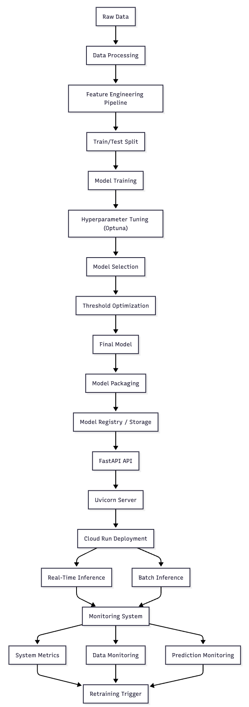

# 🏀 NBA Player Longevity Predictor — End-to-End MLOps Project


---

## 📌 Overview

This project is a **production-ready Machine Learning system** that predicts whether an NBA player will have a career lasting more than **5 years**, based on early-career statistics.

This repository covers the **full ML lifecycle**:

👉 Data processing → Feature engineering → Model training → Packaging → Deployment → Monitoring

---

## 🧠 Problem Statement

Predicting player longevity is a **binary classification problem**:

- 🎯 Target: `TARGET_5Yrs` (1 = career ≥ 5 years, 0 otherwise)
- 📊 Input: player performance statistics (GP, PTS, FG%, etc.)

---

# 🔄 ## 🧠 System Architecture



# 📊 1. DATA CYCLE

## ✅ Data Processing

- Handling missing values
- Outlier analysis (domain-aware, not blindly removed)
- Feature validation rules
- Dataset consistency checks

## 🧠 Key Decisions

- Preserve valid extreme values (important in sports data)
- Avoid over-cleaning → maintain real-world distribution

---

# 🧪 2. FEATURE ENGINEERING CYCLE

## 🔧 Implemented Features

- Base features: player statistics
- Skewness analysis & transformation strategy
- Scaling (StandardScaler)
- Feature selection (optional RF-based importance)

## 📈 Feature Pipeline

- Automated pipeline using `scikit-learn`
- Reproducible transformations
- Stored transformation metadata

---

# 🤖 3. MODEL CYCLE

## 🔍 Models Used

- Random Forest
- Balanced Random Forest
- XGBoost

## ⚙️ Training Strategy

- Cross-validation (Stratified K-Fold)
- Hyperparameter tuning (Optuna)
- Class imbalance handling (SMOTE)

## 📊 Evaluation Metrics

- Primary: **F1-score**
- Secondary: Precision, Recall, Accuracy

## 🎯 Threshold Optimization

- Custom decision threshold (not default 0.5)
- Optimized for business objective (F1)

---

# 📦 4. MODEL PACKAGING (Production Ready)

Instead of saving only a model file, we package:

model.joblib
package_manifest.json
feature_list.json
threshold.json
metrics.json


## 💡 Why it matters

- Reproducibility
- Versioning
- Easy rollback
- Production compatibility

---

# 🚀 5. SERVING LAYER (FastAPI)

## ⚙️ API Endpoints

- `/predict` → Real-time inference
- `/predict_batch` → Batch inference
- `/metrics` → Monitoring
- `/health` → Health check

## 🧠 Key Features

- Input validation
- Model loaded at startup
- Error handling
- Logging integration

---

# ⚡ Real-Time vs Batch Inference

| Type | Use Case |
|------|--------|
| Real-time | User interaction |
| Batch | Large-scale scoring |

👉 Both are implemented in this project.

---

# ☁️ 6. CLOUD DEPLOYMENT (GCP - Cloud Run)

## 🔧 Stack

- Docker containerization
- Google Cloud Run (serverless deployment)

## 💡 Benefits

- Auto-scaling
- Pay-per-use
- No infrastructure management

---

# 📊 7. MONITORING SYSTEM

This project includes **production-level monitoring**.

---

## ⚙️ System Monitoring

- Latency (avg, p95)
- Throughput
- Success rate
- Error rate

---

## 📊 Data Monitoring

- Input validation errors
- Missing features tracking
- Schema consistency

---

## 🔍 Drift Monitoring

### Data Drift
→ Change in input feature distribution

### Concept Drift
→ Change in relationship between features & target

---

# 🔁 8. RETRAINING STRATEGY (Next Step)

Planned:

- Drift-triggered retraining
- Scheduled retraining
- Model comparison (champion vs challenger)

---

# 🧪 9. TESTING & CI/CD

## ✅ Testing

- Unit tests (pytest)
- API tests
- End-to-end pipeline test

## 🔁 CI Pipeline

- GitHub Actions
- Automatic test execution

## 🚀 CD Pipeline

- Docker build
- Deployment automation

---

# 🐳 10. RUN LOCALLY

```bash
git clone https://github.com/IbtissamLou/nba-player-longevity.git
cd nba-player-longevity

python -m venv .venv
source .venv/bin/activate

pip install -r requirements.txt

uvicorn app.main:app --reload

👉 API: http://127.0.0.1:8080

👉 Docs: http://127.0.0.1:8080/docs

☁️ DEPLOYED API

👉 https://nba-model-api-773xjegv7a-uc.a.run.app

📊 EXAMPLE REQUEST

curl -X POST /predict \
-H "Content-Type: application/json" \
-d '{ "features": {...} }'

🔥 KEY MLOPS CONCEPTS IMPLEMENTED

Feature pipeline
Model versioning
Threshold optimization
Real-time & batch inference
Monitoring (system + data + predictions)
Cloud deployment (serverless)
CI/CD pipelines

🧠 KEY LEARNINGS

A model is not the product — the system is
Monitoring is as important as training
Reproducibility is critical in ML systems
Deployment constraints shape model design

🚀 FUTURE IMPROVEMENTS

Automated retraining pipeline
Advanced drift detection (Evidently AI)
Dashboard (Grafana / Streamlit)

👩‍💻 Author

Ibtissam LOUKILI
ML Engineer

📧 ibtissamloukili20@gmail.com